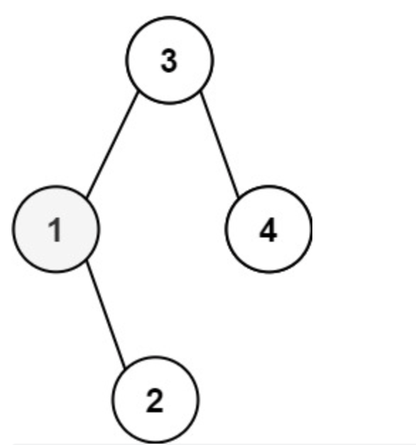

# 230. Kth Smallest Element in a BST

> https://leetcode.com/problems/kth-smallest-element-in-a-bst/
>
> Medium

#### Description:

---

Given the `root` of a binary search tree, and an integer `k`, return *the* `kth` *smallest value (**1-indexed**) of all the values of the nodes in the tree*.

**Example 1:**



```Java
Input: root = [3,1,4,null,2], k = 1
Output: 1
```


#### Discussion

---

Some properties of the binary search tree (BST):

1. The key of any node is greater than all keys occurring in its left subtree and less than all keys occurring in its right subtree. 
2. <u>In-order traversal</u> of the BST yields the elements sorted in non-decreasing order. 

Therefore we build an in-order traversal of BST and the `k-1`th element of the array is the result. 


#### Code

----

```Java
class Solution {
    private int step;
    private int target;
    public int kthSmallest(TreeNode root, int k) {
        step = k;
        target = -1;
        traverse(root);
        return target;
    }
    
    private void traverse(TreeNode root){
        // meeting a 'null' will not reduce the step
        if (root == null) return; 
        
        traverse(root.left);
        
        /* middle */
        step--;
      	// once we get the target value, we stop the traversal
        if (step == 0) {
            target = root.val;
            return;
        }
        
        traverse(root.right);
    }
}
```

