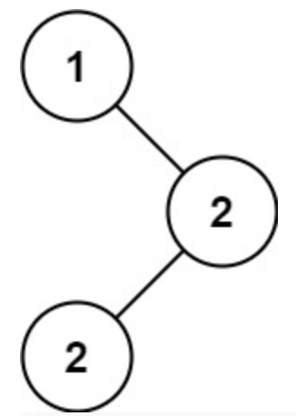

# 501. Find Mode in Binary Search Tree

> https://leetcode.com/problems/find-mode-in-binary-search-tree/
>
> Easy

#### Description:

---

Given the `root` of a binary search tree (BST) with duplicates, return *all the mode(s) (i.e., the most frequently occurred element) in it*.

If the tree has more than one mode, return them in **any order**.

Assume a BST is defined as follows:

- The left subtree of a node contains only nodes with keys **less than or equal to** the node's key.
- The right subtree of a node contains only nodes with keys **greater than or equal to** the node's key.
- Both the left and right subtrees must also be binary search trees.

**Example 1:**



```Java
Input: root = [1,null,2,2]
Output: [2]
```


#### Discussion

---

1. Maintain a `TreeNode` variable`res` to record the previous node, and a `curCount` variable to record the number of occurrence of the current repeating value.
2. Maintain a `LinkedList` that stores all eligible `TreeNode`, and a `maxCount` variable that record the number of occurrence of the mode. 
3. In-order traversal. 


#### Code

----

```Java
class Solution {
    private TreeNode prev;
    private int maxCount;
    private int curCount;
    private LinkedList<Integer> mode;
    public int[] findMode(TreeNode root) {
        mode = new LinkedList<>();
        traverse(root);
        
        // output result
        int[] result = new int[mode.size()];
        int i = 0;
        while(!mode.isEmpty()) result[i++] = mode.removeLast();
        
        return result;
    }
    
    private void traverse(TreeNode root){
        if (root == null) return;
        
        traverse(root.left);
        
        /* middle */
      	// initialization
        if (prev == null) {
            mode.addLast(root.val);
            curCount = 1;
            maxCount = 1;
        } else if (prev.val == root.val){
            curCount++;
            if (curCount == maxCount) mode.addLast(root.val);
            else if (curCount > maxCount){
                maxCount = curCount;
                mode.clear();
                mode.addLast(root.val);
            }
        } else {
            curCount = 1;
            if (curCount == maxCount) mode.addLast(root.val);
        }
        prev = root;

        traverse(root.right);
        
        return;
    }
}
```

