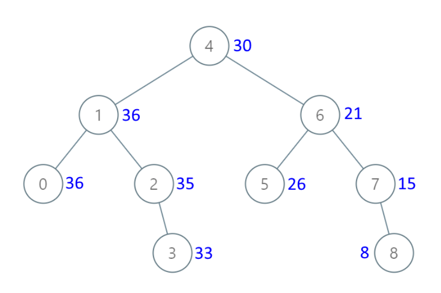

# 538. Convert BST to Greater Tree

> https://leetcode.com/problems/convert-bst-to-greater-tree/
>
> Medium

#### Description:

---

Given the `root` of a Binary Search Tree (BST), convert it to a Greater Tree such that every key of the original BST is changed to the original key plus the sum of all keys greater than the original key in BST.

As a reminder, a *binary search tree* is a tree that satisfies these constraints:

- The left subtree of a node contains only nodes with keys **less than** the node's key.
- The right subtree of a node contains only nodes with keys **greater than** the node's key.
- Both the left and right subtrees must also be binary search trees.

**Example 1:**



```Java
Input: root = [4,1,6,0,2,5,7,null,null,null,3,null,null,null,8]
Output: [30,36,21,36,35,26,15,null,null,null,33,null,null,null,8]
```


#### Discussion

---

It's actually the revesal order of the in-order traversal. 

Time complexity: $O(N)$


#### Code

----

```Java
class Solution {
    private int res = 0;
    public TreeNode convertBST(TreeNode root) {
       traverse(root); 
       return root;
    }
    
    private void traverse(TreeNode root){
        if (root == null) return;
        
        traverse(root.right);
        
        /* in-order/middle */
        res += root.val;
        root.val = res;
        
        traverse(root.left);
        
        return;
    }
}
```

