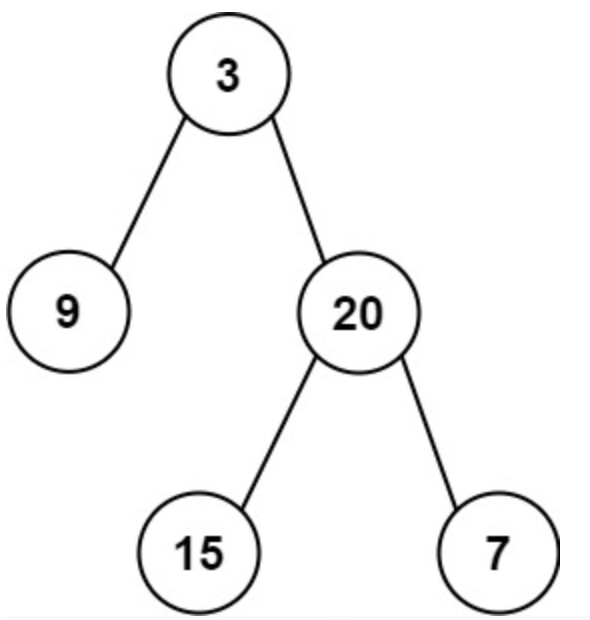
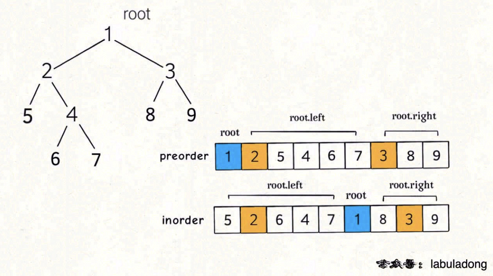

# 105. Construct Binary Tree from Preorder and Inorder Traversal

> https://leetcode.com/problems/construct-binary-tree-from-preorder-and-inorder-traversal/
>
> Medium

#### Description:

---

Given two integer arrays `preorder` and `inorder` where `preorder` is the preorder traversal of a binary tree and `inorder`is the inorder traversal of the same tree, construct and return *the binary tree*.

**Example 1:**



```Java
Input: preorder = [3,9,20,15,7], inorder = [9,3,15,20,7]
Output: [3,9,20,null,null,15,7]
```


#### Discussion

---

Recall the properties of preorder traversal and inorder traversal (from *labuladong的算法秘籍V2.4*):



1. The first index of the preorder subarray is  `root`:
2. Find index `inorderIdx` of the `root` at the inorder subarray, which is also the `size` of left subtree.
3. Build the left subtree on the subarray prefix on the left of `inorderIdx`.
4. Build the right subtree on the subarray suffix on the right of `inorderIdx`.

#### Code

----

```Java
class Solution {
    public TreeNode buildTree(int[] preorder, int[] inorder) {
        return build(preorder, preorder.length-1, 0, inorder, inorder.length-1, 0);
    }
    
    private TreeNode build(int[] preorder, int preHi, int preLo, int[] inorder, int inHi, int inLo){
        if (preLo > preHi || inLo > inHi) return null;
        
        // find the root at inorder traversal array
        int inorderIdx = -1, sz = -1;
        for (int i= inLo; i<= inHi; i++){
            if (inorder[i] == preorder[preLo]) inorderIdx = i;
        }
        if (inorderIdx == -1) return null;
        sz = inorderIdx - inLo;
        
        TreeNode root = new TreeNode(preorder[preLo]);
        
        // build subtree
        root.left = build(preorder, sz + preLo, preLo + 1, inorder, inorderIdx - 1, inLo);
        root.right = build(preorder, preHi, sz + preLo + 1, inorder, inHi, inorderIdx + 1);
        
        return root;
    }
}


/* Notice: traverse the array to find the target is time wasting, try to build a HashMap and access the target's idx with O(1) time complexity */

class Solution {
    private HashMap<Integer, Integer> inorderMap = new HashMap<>();
    public TreeNode buildTree(int[] preorder, int[] inorder) {
        for (int i=0; i<inorder.length; i++){
            inorderMap.put(inorder[i], i);
        }
        
        return build(preorder, preorder.length-1, 0, inorder, inorder.length-1, 0);
    }
    
    private TreeNode build(int[] preorder, int preHi, int preLo, int[] inorder, int inHi, int inLo){
        if (preLo > preHi || inLo > inHi) return null;
        
        // find the root at inorder traversal array
        int inorderIdx = inorderMap.get(preorder[preLo]);
        int sz = inorderIdx - inLo;
        
        TreeNode root = new TreeNode(preorder[preLo]);
        
        // build subtree
        root.left = build(preorder, sz + preLo, preLo + 1, inorder, inorderIdx - 1, inLo);
        root.right = build(preorder, preHi, sz + preLo + 1, inorder, inHi, inorderIdx + 1);
        
        return root;
    }
}

```

