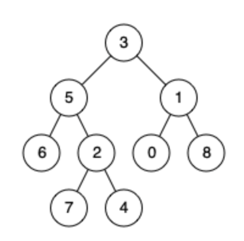
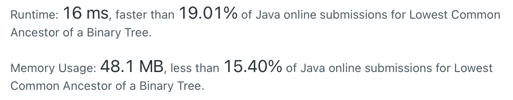
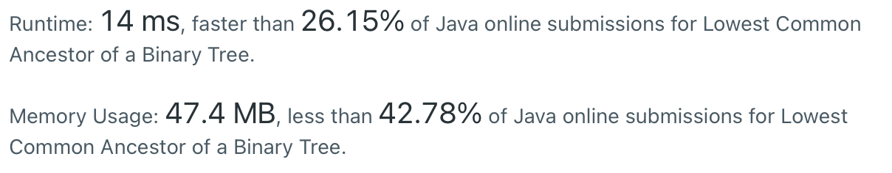

# 236. Lowest Common Ancestor of a Binary Tree

> https://leetcode.com/problems/lowest-common-ancestor-of-a-binary-tree/
>
> Medium

#### Description:

---

Given a binary tree, find the lowest common ancestor (LCA) of two given nodes in the tree.

According to the definition of LCA on Wikipedia: “The lowest common ancestor is defined between two nodes `p` and `q` as the lowest node in `T` that has both `p` and `q` as descendants (where we allow **a node to be a descendant of itself**).”

**Example 1:**



```Java
Input: root = [3,5,1,6,2,0,8,null,null,7,4], p = 5, q = 1
Output: 3
Explanation: The LCA of nodes 5 and 1 is 3.
```


#### Discussion

---

**Solution # 1**

1. Post-order traversal: if the root contains tree node `p`, the variable `containsP` is true; if the root contains tree node `q`, the variable `containsQ` is ture; if both variable in the left and right subtree becomes true, than the root val is a common ancestor.
2. The lowest common ancestor is the first common ancester appeared in the post-order traversal. We record it in a global variable. 


**Solution # 2**

Another solution also uses post-order traversal. Instead, the traverse method returns the lowers ancestor of the target nodes. Two methods have similar time complexity, which is $O(N)$

---

#### Solution # 1

```Java
class Solution {
    private TreeNode lca;
    public TreeNode lowestCommonAncestor(TreeNode root, TreeNode p, TreeNode q) {
        traverse(root, p, q);
        return lca;
    }
    
    private int traverse(TreeNode root, TreeNode p, TreeNode q){
        // base case
        if (root == null) return 0;
        
        // postorder traversal
        int res = 0;
        int left = traverse(root.left, p, q);
        int right = traverse(root.right, p, q);
        if (root.val == p.val || root.val == q.val) res++;
        res += left + right;
        
        // record the lowest common ancestor in a global variable
        if (res == 2 && lca == null) lca = root;
        
        return res;
    }
}

```




#### Solution #2

```java
class Solution{
    private int ans;
    public TreeNode lowestCommonAncestor(TreeNode root, TreeNode p, TreeNode q) {
        if (root == null) return null;
        TreeNode lca = traverse(root, p, q);
        return ans == 2 ? lca : null;
    }
    
    private TreeNode traverse(TreeNode root, TreeNode p, TreeNode q){
        // base case
        if (root == null) return null;
        
        // postorder traversal
        TreeNode left = traverse(root.left, p, q);
        TreeNode right = traverse(root.right, p, q);
        
        
        if (root.val == p.val || root.val == q.val) {
            ans++;
            return root;
        }
        if (left != null && right != null) return root;
        if (left == null && right == null) return null;
        
        return left != null ? left : right;
    }
}
```



