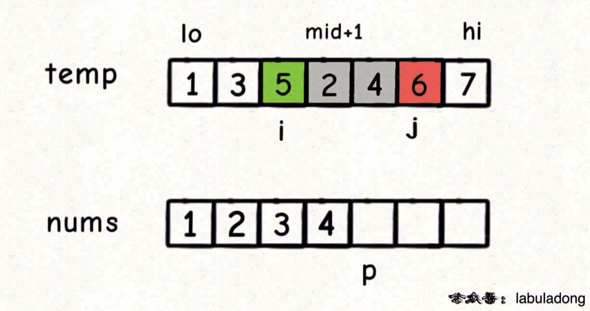

# 315. Count of Smaller Numbers After Self

> https://leetcode.com/problems/count-of-smaller-numbers-after-self/
>
> Hard

#### Description:

---

Given an integer array `nums`, return *an integer array* `counts` *where* `counts[i]` *is the number of smaller elements to the right of* `nums[i]`.

**Example 1:**

```Java
Input: nums = [5,2,6,1]
Output: [2,1,1,0]
Explanation:
To the right of 5 there are 2 smaller elements (2 and 1).
To the right of 2 there is only 1 smaller element (1).
To the right of 6 there is 1 smaller element (1).
To the right of 1 there is 0 smaller element.
```


#### Discussion

---

1. We will use merge sort to solve to problem. But we are not supposed to use HashMap because elements can be repeated in `nums`.

2. We don't want to search the target number after sorting, because it will take $O(N^2)$ complexity (for each number, traverse the array. And we have $n$ numbers.). Is there any convenient way ($O(1)$ time complexity) to help us quickly get the index of the number after sorting?

3. I can't come up with a solution by myself. Here's an answer from *labuladong的算法秘籍*:

   * As merging the array nums[lo...hi], each time we perform nums[p] = temp[i], we could figure out there's how many smaller number right after temp[i]. The grey part (**j-mid-1**) indicates the range where numbers are smaller than temp[i].  

     

#### Code

----

```Java
class Solution {
  	private class Pair {
    	int val, id;
      	Pair(int val, int id) {
        	// record the value
          	this.val = val;
          	this.id = id;
      	}
    }
  	
  	private Pair[] temp;
  	private int[] count;
    public List<Integer> countSmaller(int[] nums) {
        int n = nums.length;
        count = new int[n];
        temp = new Pair[n];
        Pair[] arr = new Pair[n];
        
        // record the idx of each element in the original array nums
        for (int i=0; i<n; i++){
            arr[i] = new Pair(nums[i], i);
        }
        
        // sorting and update count array simultaneously
        sort(arr, 0, n-1);
        
        List<Integer> res = new LinkedList<>();
        for (int c : count) res.add(c); 
        
        return res;
    }
  
  	private void sort(Pair[] nums, int lo, int hi){
        // base case
        if (lo == hi) return;
            
        int mid = lo + (hi - lo) / 2;
        // postorder traversal
        sort(nums, lo, mid); // left side
        sort(nums, mid+1, hi); // right side
            
        // 后序位置
        merge(nums, lo, mid, hi);

        return;
    }
    
    // use double pointer to merge two array
    private void merge(Pair[] nums, int lo, int mid, int hi){
        for (int i=lo; i<=hi; i++) temp[i] = nums[i];
        int i = lo, j = mid  + 1;
        for (int p = lo; p <= hi; p++){
            // if the left part has been traversed, read the right part
            if (i == mid + 1) nums[p] = temp[j++];
            else if (j == hi + 1) {
              	nums[p] = temp[i++];
              	// update count array
              	count[nums[p].id] += j - mid - 1;
            }
            else if (temp[i].val > temp[j].val) nums[p] = temp[j++];
            else {
              	nums[p] = temp[i++];
              	// update count array
              	count[nums[p].id] += j - mid - 1;
            }
        }
    }
}

```

