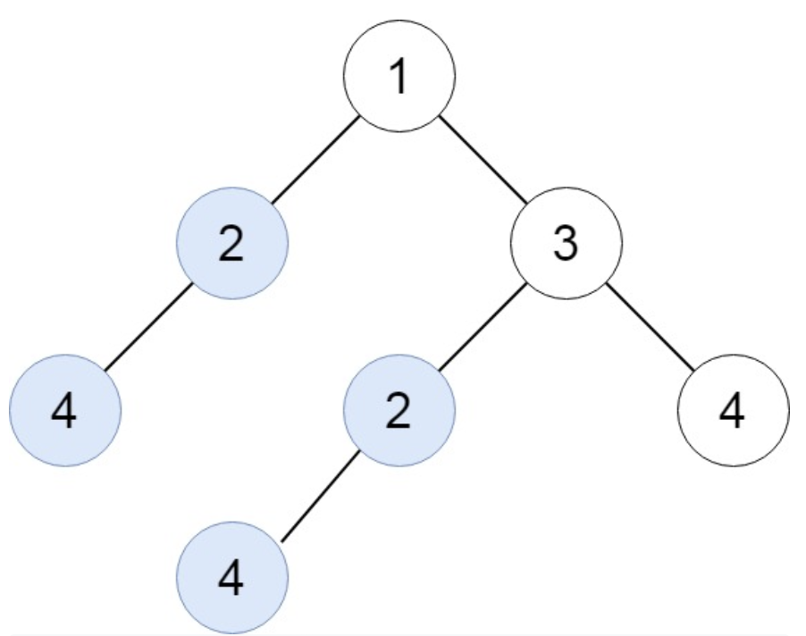
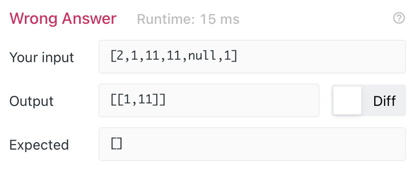

# 652. Find Duplicate Subtrees

> https://leetcode.com/problems/find-duplicate-subtrees/
>
> Medium

#### Description:

---

Given the `root` of a binary tree, return all **duplicate subtrees**.

For each kind of duplicate subtrees, you only need to return the root node of any **one** of them.

Two trees are **duplicate** if they have the **same structure** with the **same node values**.

**Example 1:**



```Java
Input: root = [1,2,3,4,null,2,4,null,null,4]
Output: [[2,4],[4]]
```


#### Discussion

---

1. To compare the structure of two trees, we could serialize them into a string. 

2. How to build a string that describe the tree? The method `serialize` returns serials of both left subtree and right subtree. We could simply concatenate them with `root.val`. 

3. Base case: use symbol # to represent `null`.

4. Concatenate strings in Java:

   ``` java
   String a1 = "a1";
   String a2 = "a2";
   String concat = a1 + "," + a2;
   ```

4. To record the occurance of each subtree, we use the HashMap. 

5. **Notice: we should not leave out "," within a serial number**

   

   A set of duplicate trees are those trees that share an identical structure and numbers. 

   If we leave out ",", we will identify trees, that have same serial numbers but not the same structure, as duplicate trees. 
   
   ```java
   Input: root = [2,1,11,11,null,1]
   Tree Structure: 
   2 - 1 - 11 - null (left)
              - 1 (right)
         - 11
    ------------------------------
   /* Serial numbers of the tree would be like: #,1,11,11,1,2.
   	 If we left out the comma, the serial numbers would be like: #1111112.
   	 Obviously, it will generate a wrong answer 
      for example: [1 (left), 11 (root)] looks just like [11 (left), 1 (root)] */
   ```
   

----

```Java
class Solution {
		private HashMap<String, Integer> treeSet = new HashMap<>();
    private List<TreeNode> l = new ArrayList<TreeNode>();
    public List<TreeNode> findDuplicateSubtrees(TreeNode root) {
        serialize(root);
        return l;
    }
    
    private String serialize(TreeNode root){
        // base case
        if (root == null) return "#";
        
        // serialize
        String left = serialize(root.right);
        String right = serialize(root.left);
        
        String thisTree = left + "," + right + "," + root.val;
        
        // check if the tree has occured
        int freq = treeSet.getOrDefault(thisTree, 0);
        if (freq == 1) l.add(root); // if the tree has occured
        treeSet.put(thisTree, freq+1);
        
        return thisTree;
    }
}

```

