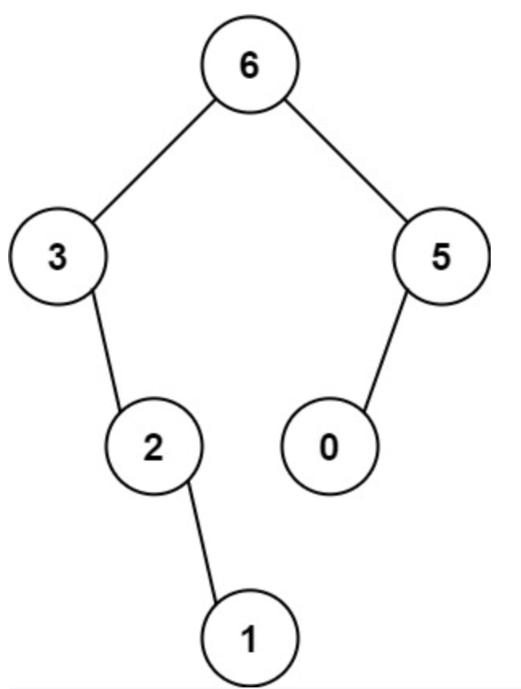

# 654. Maximum Binary Tree

> https://leetcode.com/problems/maximum-binary-tree/
>
> Medium

#### Description:

---

You are given an integer array `nums` with no duplicates. A **maximum binary tree** can be built recursively from `nums` using the following algorithm:

1. Create a root node whose value is the maximum value in `nums`.
2. Recursively build the left subtree on the **subarray prefix** to the **left** of the maximum value.
3. Recursively build the right subtree on the **subarray suffix** to the **right** of the maximum value.

Return *the **maximum binary tree** built from* `nums`.

**Example 1:**



```Java
Input: nums = [3,2,1,6,0,5]
Output: [6,3,5,null,2,0,null,null,1]
Explanation: The recursive calls are as follow:
- The largest value in [3,2,1,6,0,5] is 6. Left prefix is [3,2,1] and right suffix is [0,5].
    - The largest value in [3,2,1] is 3. Left prefix is [] and right suffix is [2,1].
        - Empty array, so no child.
        - The largest value in [2,1] is 2. Left prefix is [] and right suffix is [1].
            - Empty array, so no child.
            - Only one element, so child is a node with value 1.
    - The largest value in [0,5] is 5. Left prefix is [0] and right suffix is [].
        - Only one element, so child is a node with value 0.
        - Empty array, so no child.
```


#### Discussion

---

We will apply recursion and post-order traversal to build maximum binary tree. 

**Base case**: when `root` has no child (i.e. the subarray has only one number), then `root` itself is a maximum binary tree. 

For each **subproblem**, we build subtree on the subarray, so we for every subproblem we pass two variables, `lo` and `hi` for defining the range of subarray. 

**Boundary case**: when `lo` > `hi`, return `null`;

`root.val` is the maximum number in the subarray, so we need a step to find the maximum number. 

#### Code

----

```Java
class Solution {
    public TreeNode constructMaximumBinaryTree(int[] nums) {
        return build(nums, 0, nums.length-1);
    }
    
    private TreeNode build(int[] nums, int lo, int hi){
        // base case
        if (lo>hi) return null;
        if (lo==hi) return new TreeNode(nums[lo]);
        
        // find max in the array
        int res = 0;
        int mid = -1;
        for (int i=lo; i<=hi; i++){
            if (nums[i]>=res){
                mid = i;
                res = nums[i];
            }
        }
        
        // build binary tree
        TreeNode root = new TreeNode(res);
        root.left = build(nums, lo, mid-1);
        root.right = build(nums, mid+1, hi);
        
        return root;
    }
}
```

