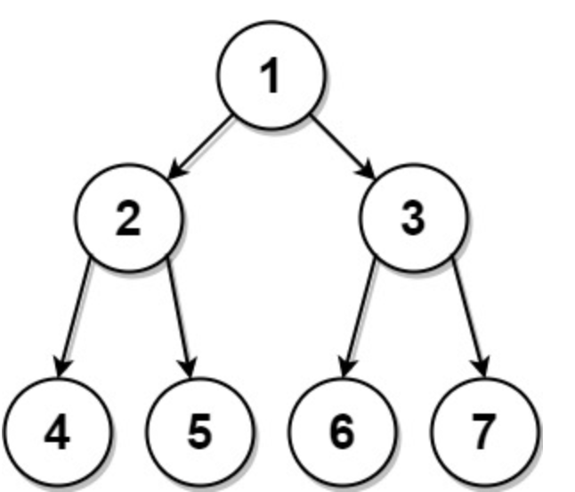

# 889. Construct Binary Tree from Preorder and Postorder Traversal

> https://leetcode.com/problems/construct-binary-tree-from-preorder-and-postorder-traversal/
>
> Medium

#### Description:

---

Given two integer arrays, `preorder` and `postorder` where `preorder` is the preorder traversal of a binary tree of **distinct** values and `postorder` is the postorder traversal of the same tree, reconstruct and return *the binary tree*.

If there exist multiple answers, you can **return any** of them.

**Example 1:**



```Java
Input: preorder = [1,2,4,5,3,6,7], postorder = [4,5,2,6,7,3,1]
Output: [1,2,3,4,5,6,7]
```


#### Discussion

---

Postorder: left - right - middle

Preorder: middle - left -right

Through `preorder` array, we could get the root value of this BT and **the root value of left subtree**. Through searching the root value of left subtree in `postorder` array, we could get the **size** of the left subtree. 


#### Code

----

```Java
class Solution {
		private HashMap<Integer, Integer> postorderMap = new HashMap<>();
    public TreeNode constructFromPrePost(int[] preorder, int[] postorder) {
        for (int i=0; i<postorder.length; i++) postorderMap.put(postorder[i], i); // all the values are unique
        return build(preorder, 0, preorder.length-1, postorder, 0, postorder.length-1);
    }
    
    private TreeNode build(int[] preorder, int preLo, int preHi, int[] postorder, int postLo, int postHi){
        if (preLo > preHi || postLo > postHi) return null;
        if (preLo == preHi) return new TreeNode(preorder[preLo]);
        
        // find the root value of the left subtree and the index of the value in postorder arrray
        int leftRootIdx = postorderMap.get(preorder[preLo+1]);
        
        // calculate the indices of left subtree and right subtree
        int sz = leftRootIdx - postLo + 1;
        int preLeftLo = preLo + 1, preLeftHi = sz + preLeftLo -1;
        int preRightLo = preLeftHi + 1, preRightHi = preHi;
        int postLeftLo = postLo, postLeftHi = sz + postLeftLo - 1;
        int postRightLo = postLeftHi + 1, postRightHi = postHi - 1;
        
        // build left subtree and right subtree
        TreeNode root = new TreeNode(preorder[preLo]);
        root.left = build(preorder, preLeftLo, preLeftHi, postorder, postLeftLo, postLeftHi);
        root.right = build(preorder, preRightLo, preRightHi, postorder, postRightLo, postRightHi);
        
        return root;
    }
  
}

```

