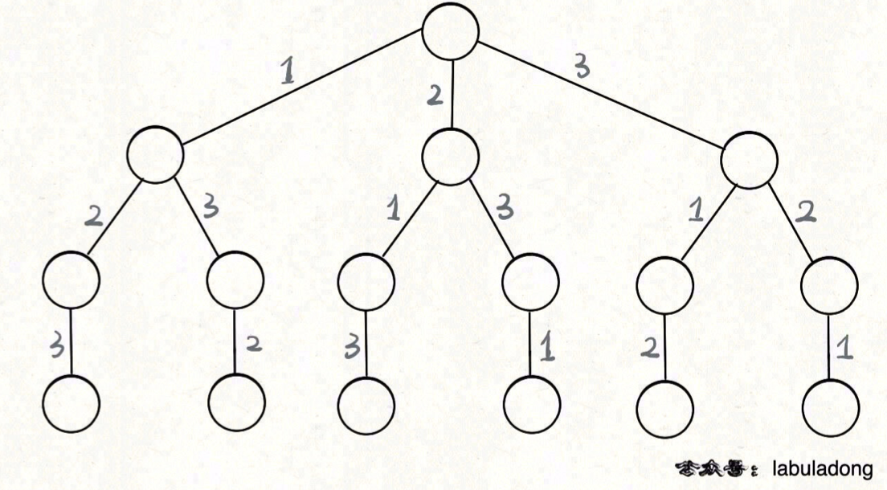

# 46. Permutations

> https://leetcode.com/problems/permutations/
>
> Medium

#### Description:

---

Given an array `nums` of distinct integers, return *all the possible permutations*. You can return the answer in **any order**.


**Example 1:**

```Java
Input: nums = [1,2,3]
Output: [[1,2,3],[1,3,2],[2,1,3],[2,3,1],[3,1,2],[3,2,1]]
```


#### Discussion

---

1. Think it as a tree

    

2. Depth-first Search (DFS)

    * The root node will not be recorded because it has no meaning.

    * Back-Track Algorithm

        ```java
        void backtrack(int i) {
        	if (visited[i]) return;
            visited[i] = true;
        	
        	for (int child : i.children()) {
                print("enter", i); 
                backtrack(i);
                print("leave", i);
            }
        	return;
        }
        ```

        

Reference: [labuladong的算法秘籍](https://labuladong.gitee.io/algo/)

#### Code

----

```Java
class Solution {
    private List<List<Integer>> res;
    public List<List<Integer>> permute(int[] nums) {
        res = new LinkedList<>();
        LinkedList<Integer> path = new LinkedList<>();
        boolean[] onPath = new boolean[nums.length];
        backtrack(path, onPath, nums);
        return res;
    }
    
    private void backtrack(LinkedList<Integer> path, boolean[] onPath, int[] nums) {
        // if all numbers in nums array has been visited
        if (path.size() == nums.length) {
            res.add(new LinkedList<Integer>(path));
            return;
        }
        
        // traverse all the children
        for (int i = 0; i < nums.length; i++) {
            if (onPath[i]) continue;
            // enter i
            path.addLast(nums[i]);
            onPath[i] = true;
            
            // go to the next level of the tree
            backtrack(path, onPath, nums);
            
            // leave i
            path.pollLast();
            onPath[i] = false;
        }
        return;
    }
}
```

 
