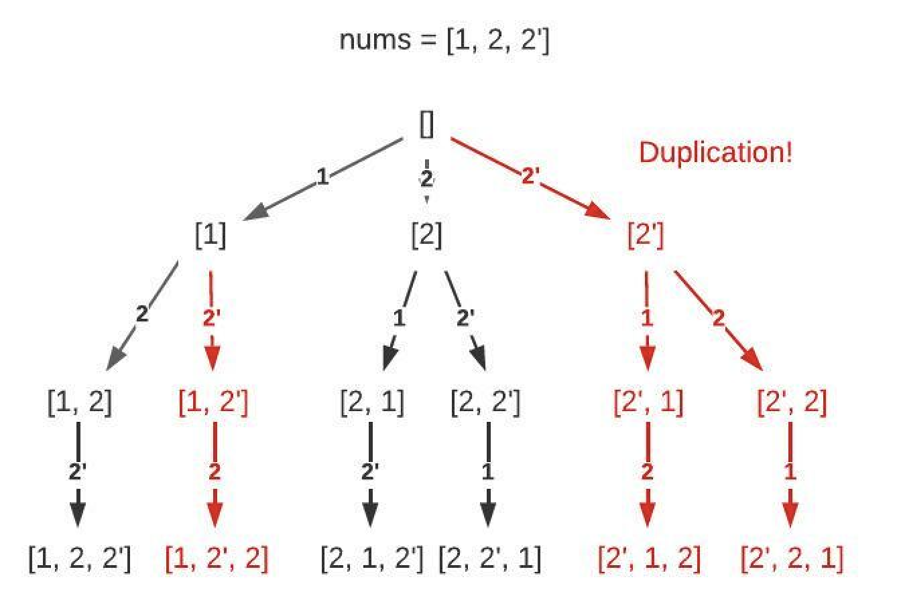

# 47. Permutations II

> https://leetcode.com/problems/permutations-ii/
>
> Medium

#### Description:

---

Given a collection of numbers, `nums`, that might contain duplicates, return *all possible unique permutations **in any order**.*


**Example 1:**

```Java
Input: nums = [1,1,2]
Output:
[[1,1,2],
 [1,2,1],
 [2,1,1]]
```


#### Discussion

---

Permutation: numbers in the array  are not unique, do not support repeated selection

1. Similar problem as #46.

2. When path.size() == nums.size(), set.add(path)

3. Avoid visited same situation (剪枝): if (i != 0 && nums[i] == nums[i-1] && !visited[i-1]) continue;

    * when we skip `i`, entering the next node `i+1`, and find out that `nums[i] == nums[i+1]`, we should not visit `nums[i+1]`. 

    

```java
/*
	int start: traverse from largest number to smallest number, nums[..start] are too large to fit into the current set, thus traversal start from nums[start..]
	LinkedList<Integer> path: current path record
	int target: target subset sum
*/
private void backtrack(LinkedList<Integer> path, boolean[] onPath, int[] nums) {
    /* before traversal */
    if (path.size() == targetSize) {
        res.add(new LinkedList(path));
        return;
    }
    
    /* traverse all subtree */
    for (int i = 0; i < nums.length; i++) {
        if (i != 0 && nums[i] == nums[i-1] && !visited[i-1]) continue;
        if (onPath[i]) continue;
		...
    }
}
```

 Reference: [labuladong的算法秘籍](https://labuladong.gitee.io/algo/)


#### Code

---

```java
class Solution {
    private List<List<Integer>> res;
    public List<List<Integer>> combinationSum3(int k, int n) {
        res = new LinkedList<>();
        LinkedList<Integer> path = new LinkedList<>();
        backtrack(1, 0, n, k, path);
        return res;        
    }
    
    /*
        int start: traverse from largest number to smallest number, nums[..start] are too large to fit into the current set, thus traversal start from nums[start..]
        LinkedList<Integer> path: current path record
        int target: target subset sum
    */
    private void backtrack(int start, int currSum, int targetSum, int targetSize, LinkedList<Integer> path) {
        /* before traversal */
        if (path.size() == targetSize) {
            if (currSum == targetSum) res.add(new LinkedList(path));
            return;
        }

        /* traverse all subtree */
        for (int i = start; i <= 9; i++) {
            if (currSum + i > targetSum) continue;
            currSum += i;
            path.addLast(i);
            backtrack(i + 1, currSum, targetSum, targetSize, path);
            currSum -= i;
            path.removeLast();
        }
    }    
}
```

