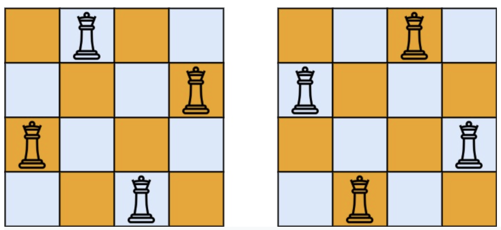

# 51. N-Queens

> https://leetcode.com/problems/n-queens/
>
> Hard

#### Description:

---

The **n-queens** puzzle is the problem of placing `n` queens on an `n x n` chessboard such that no two queens attack each other.

Given an integer `n`, return *all distinct solutions to the **n-queens puzzle***. You may return the answer in **any order**.

Each solution contains a distinct board configuration of the n-queens' placement, where `'Q'` and `'.'` both indicate a queen and an empty space, respectively.


**Example 1:**



```Java
Input: n = 4
Output: [[".Q..","...Q","Q...","..Q."],["..Q.","Q...","...Q",".Q.."]]
Explanation: There exist two distinct solutions to the 4-queens puzzle as shown above
```


#### Discussion

---

Back-Track Algorithm

```java
void backtrack(int i) {
	if (visited[i]) return;
    visited[i] = true;
	
	for (int child : i.children()) {
        print("enter", i); 
        backtrack(i);
        print("leave", i);
    }
	return;
}
```


Reference: [labuladong的算法秘籍](https://labuladong.gitee.io/algo/)

#### Code

----

```Java
class Solution {
    private List<List<String>> res;
    public List<List<String>> solveNQueens(int n) {
        res = new LinkedList<>();
        boolean[][] board = new boolean[n][n];
        backtrack(0, board);
        return res;
    }
    
    private void backtrack(int level, boolean[][] board) {
        // if all rows has been visited, convert board into string list
        if (level > board.length-1) {
            res.add(convertString(board));
            return;
        }
        
        for (int i = 0; i < board[level].length; i++) {
            // place should not be occupied (will cause attack) or has been occupied 
            if (board[level][i] || ifAttack(level, i, board)) continue;
            
            // occupy the board
            board[level][i] = true;
            
            backtrack(level+1, board);
            
            // remove the queen
            board[level][i] = false;
        }
        
    }
    
    // track if this position will cause queens attack each other
    private boolean ifAttack(int row, int col, boolean[][] board) {
        int left = col - 1, right = col + 1;
        for (int i = row - 1; i >= 0; i--) {
            if (board[i][col]) return true;
            if (left >= 0) {
                if (board[i][left--]) return true;
            }
            if (right < board[0].length) {
                if (board[i][right++]) return true;
            }
        }
        return false;
    }
    
    // convert board into string list
    private List<String> convertString(boolean[][] board) {
        List<String> list = new LinkedList<>();
        for (boolean[] row : board) {
            String s = new String();
            for (boolean id : row) {
                if (id) s = s + 'Q';
                else s = s + '.';
            }
            list.add(s);
        }
        return list;
    }
}
```

 
