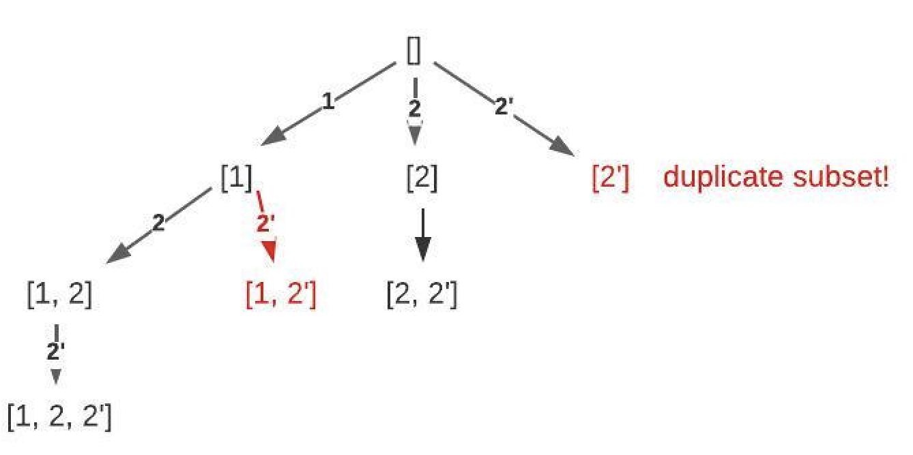

# 90. Subsets II

> https://leetcode.com/problems/subsets-ii/
>
> Medium

#### Description:

---

Given an integer array `nums` that may contain duplicates, return *all possible subsets (the power set)*.

The solution set **must not** contain duplicate subsets. Return the solution in **any order**.


**Example 1:**

```Java
Input: nums = [1,2,2]
Output: [[],[1],[1,2],[1,2,2],[2],[2,2]]
```


#### Discussion

---

Back-Track Algorithm

```java
void backtrack(int i) {
	if (visited[i]) return;
    visited[i] = true;
	
	for (int child : i.children()) {
        print("enter", i); 
        backtrack(i);
        print("leave", i);
    }
	return;
}
```

Subsets: numbers in the array  may duplicate, does not support repeated selection, subset size is not defined.



 Reference: [labuladong的算法秘籍](https://labuladong.gitee.io/algo/)


#### Code

---

```java
class Solution {
    private List<List<Integer>> res;
    public List<List<Integer>> subsetsWithDup(int[] nums) {
        // to make duplicate numbers neighboring to each other
        Arrays.sort(nums);
        
        res = new LinkedList<>();
        LinkedList<Integer> path = new LinkedList<>();
        backtrack(nums, 0, path);
        return res;
    }
    
    /*
        int start: nums[...start] are all visited numbers and should not be used again (avoid repeated selection).
        LinkedList<Integer> path: current path record. 
    */
    private void backtrack(int[] nums, int start, LinkedList<Integer> path) {
        /* before traversal: each time entering new node, record path */
        res.add(new LinkedList(path));
        
        /* traverse all subtree */
        for (int i = start; i < nums.length; i++) {
            // avoid visiting duplicate numbers
            if (i > start && nums[i] == nums[i-1]) continue;
            path.addLast(nums[i]);
            backtrack(nums, i+1, path);
            path.removeLast();
        }
    }
}
```

