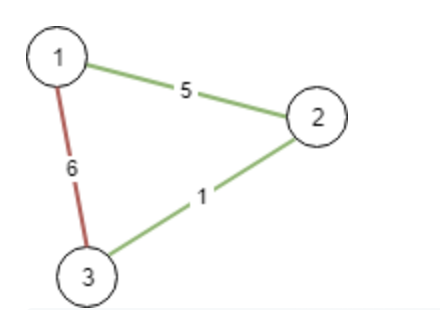

# 1135. Connecting Cities With Minimum Cost

> https://leetcode.com/problems/connecting-cities-with-minimum-cost/
>
> Medium

#### Description:

---

There are `n` cities labeled from `1` to `n`. You are given the integer `n` and an array `connections` where `connections[i] = [xi, yi, costi]` indicates that the cost of connecting city `xi` and city `yi` (bidirectional connection) is `costi`.

Return *the minimum **cost** to connect all the* `n` *cities such that there is at least one path between each pair of cities*. If it is impossible to connect all the `n` cities, return `-1`,

The **cost** is the sum of the connections' costs used.

**Example 1:**



```Java
Input: n = 3, connections = [[1,2,5],[1,3,6],[2,3,1]]
Output: 6
Explanation: Choosing any 2 edges will connect all cities so we choose the minimum 2.
```


#### Discussion

---

**Minimum Spanning Tree**

* No cycle
* all vertices are connected
* includes all vertices in a graph
* Minimum edge weights

**Algorithms to find the MST**

* Greedy algorithm

* Kruskal's algorithm

    * Sort graph edges by weight

    * Add edge to the tree unless doing so would create a cycle

    * To detect cycle: Union-Find data structure (time complexity of UF is log* V, where as time complexity of dfs is V).

    * Pseudocode:

        ```java
        UF uf = new UF(n);
        Sort edges by edge weight in non-descending order;
        for edge in edges:
        	if (!uf.connected(edge.to, edge.from)) cost+=edge.weight;
        
        if (uf.count == 1) return cost of the valid tree;
        else return not valid tree;
        ```
    
* Prim's algorithm

    * Do not need to sort graph.

    * To avoid cycle: visited[] array

    * Uses PriorityQueue to sort edges in choice.

    * Its code is similar to bfs and level order traversal.

    * Pseudocode:

        ```java
        PriorityQueue pq = new PriorityQueue();
        boolean[] visited = new boolean[n]; // n is the number of all vertices
        
        cut(0) // add all edges from vertex 0 into pq.
        while(!pq.isEmpty()) {
            int[] edge = pq.poll();
            if (visited[edge.to]) continue;
            visited[edge.to] == true;
            cut(to);
        }
        
        ```

        


#### Code

----

```Java
// Kruskal's Algorithm
class Solution {
    private UF uf;
    private int cost = 0;
    public int minimumCost(int n, int[][] connections) {
        Arrays.sort(connections, (a,b) -> {
            return Integer.compare(a[2],b[2]);
        });
        uf = new UF(n);
        for (int[] edge : connections) {
            if (!uf.connected(edge[0]-1, edge[1]-1)) {
                uf.union(edge[0]-1, edge[1]-1);
                cost += edge[2];
            }
        }
        
        return (uf.count == 1) ? cost : -1;
    }
    
        
    private class UF {
		...
    }
}

// Prim's Algorithm
class Solution {
    private List<int[]>[] graph;
    public int minimumCost(int n, int[][] connections) {
        graph = buildGraph(n, connections);
        Prim mst = new Prim(graph);
        return mst.allConnected() ? mst.weightSum() : -1;
    }
    
    private List<int[]>[] buildGraph(int n, int[][] connections) {
        List<int[]>[] graph = new LinkedList[n];
        for (int i = 0; i < n; i++) {
            graph[i] = new LinkedList<int[]>();
        }
        
        for (int[] edge : connections) {
            int from = edge[0]-1, to = edge[1]-1, weight = edge[2];
            graph[from].add(new int[] {from, to, weight});
            graph[to].add(new int[] {to, from, weight});
        }
        
        return graph;
    }
    
    private class Prim {
        private PriorityQueue<int[]> pq;
        private int weightSum = 0;
        private boolean[] visited;
        private List<int[]>[] graph;
        
        public Prim(List<int[]>[] graph) {
            this.pq = new PriorityQueue<>((a, b) -> {
                return a[2] - b[2];
            });
            this.visited = new boolean[graph.length];
            this.graph = graph;
            
            visited[0] = true;
            cut(0);
            while(!pq.isEmpty()) {
                int[] edge = pq.poll();
                int to = edge[1];
                int weight = edge[2];
                if (visited[to]) continue;
                weightSum += weight;
                visited[to] = true;
                cut(to);
            }
        }
        
        // add all edges from vertex i into the priority queue
        private void cut(int i) {
            for (int[] edge : graph[i]) {
                if (visited[edge[1]]) continue;
                pq.offer(edge);
            }
        }
        
        // check if all vertices are included into the MST
        public boolean allConnected() {
            for (int i = 0; i < visited.length; i++) {
                if (!visited[i]) return false; 
            }
            return true;
        }
        
        // return MST weight
        public int weightSum() { 
            return weightSum; 
        }
    } 
}
```

