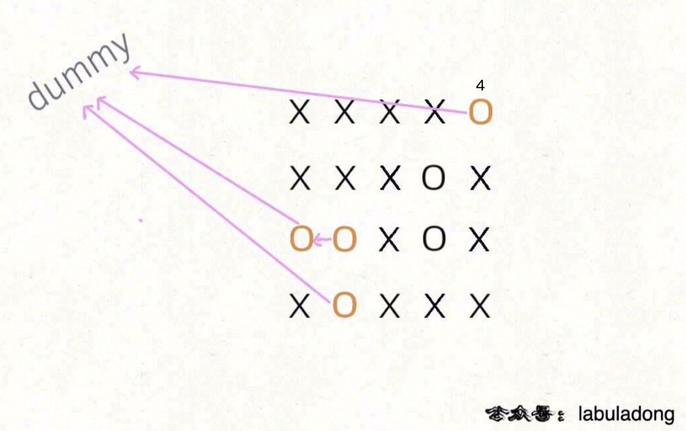

# 130. Surrounded Regions (unsolved)

> https://leetcode.com/problems/surrounded-regions/
>
> Medium

#### Description:

---

Given an `m x n` matrix `board` containing `'X'` and `'O'`, *capture all regions that are 4-directionally surrounded by* `'X'`.

A region is **captured** by flipping all `'O'`s into `'X'`s in that surrounded region.

**Example 1:**


```Java
Input: board = [["X","X","X","X"],["X","O","O","X"],["X","X","O","X"],["X","O","X","X"]]
Output: [["X","X","X","X"],["X","X","X","X"],["X","X","X","X"],["X","O","X","X"]]
Explanation: Notice that an 'O' should not be flipped if:
- It is on the border, or
- It is adjacent to an 'O' that should not be flipped.
The bottom 'O' is on the border, so it is not flipped.
The other three 'O' form a surrounded region, so they are flipped.Input: n = 5, edges = [[0,1],[1,2],[3,4]]
```


#### Discussion

---

**Union-Find**



Connect those 'O's on the boundaries of the board to a dummy node. Search through the board and connect all nodes that are not connected to the dummy node.

#### Code

----

```Java
class Solution {
    private int m;
    private int n;
    public void solve(char[][] board) {
        this.m = board.length; // row number
        this.n = board[0].length; // column number

        // create a uf set, the node at index m*n is a dummy node
        UF uf = new UF(m * n + 1);
        
        // connect nodes at boundaries to the dummy node
        // first column and last column
        for (int i = 0; i < m; i++) {
            if (board[i][0] == 'O') uf.union(convertOneD(i,0), m * n);
            if (board[i][n-1] == 'O') uf.union(convertOneD(i,n-1), m * n);
        }
        // first row and last row
        for (int i = 0; i < n; i++) {
            if (board[0][i] == 'O') uf.union(convertOneD(0,i), m * n);
            if (board[m-1][i] == 'O') uf.union(convertOneD(m-1,i), m * n);
        }
        
        // direction array: up, down, left, right
        int[][] dir = new int[][] {{-1,0}, {1, 0}, {0, -1}, {0, 1}};
        
        // search through the board, connect all eligible nodes to dummy
        for (int row = 1; row < m - 1; row++) {
            for (int column = 1; column < n - 1; column++) {
                if (board[row][column] == 'O') {
                    // search its neighbors, if find 'O', union
                    for (int[] direction : dir) {
                        int y = row + direction[0];
                        int x = column + direction[1];
                        if (board[y][x] == 'O') uf.union(convertOneD(row, column), convertOneD(y, x));
                    }
                }
            }
        }
        
        // flipping
        for (int row = 1; row < m - 1; row++) {
            for (int column = 1; column < n - 1; column++) {
                if (!uf.connected(convertOneD(row, column), n * m)) {
                    board[row][column] = 'X';
                }
            }
        }
        
        return;
    }
    
    // convert 2-D index into 1-D index
    private int convertOneD(int row, int column) {
        return row * n + column;
    }

    private class UF {
        // count united components
        private int count;
        // root of each node
        private int[] parent;

        public UF(int n) {
            this.count = n;
            parent = new int[n];
            for (int i = 0; i < n; i++) {
                parent[i] = i;
            }
        }

        // unite two node if theiy're not connected
        public void union(int p, int q) {
            int rootP = find(p);
            int rootQ = find(q);

            if (rootP == rootQ) return;

            parent[rootQ] = rootP;
            count--;
        }

        // if the two nodes share the same parent/root?
        public boolean connected(int p, int q) {
            int rootP = find(p);
            int rootQ = find(q);
            return rootP == rootQ;
        }

        public int find(int x) {
            if (parent[x] != x) {
                parent[x] = find(parent[x]);
            }
            return parent[x];
        }

        // return the count of united components
        public int count() {
            return count;
        }
    }
}
```

