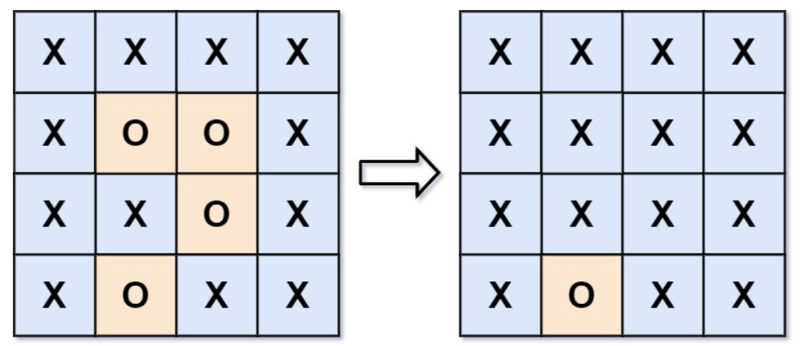

# 130. Surrounded Regions (unsolved)

> https://leetcode.com/problems/surrounded-regions/
>
> Medium

#### Description:

---

Given an `m x n` matrix `board` containing `'X'` and `'O'`, *capture all regions that are 4-directionally surrounded by* `'X'`.

A region is **captured** by flipping all `'O'`s into `'X'`s in that surrounded region.

**Example 1:**



```Java
Input: board = [["X","X","X","X"],["X","O","O","X"],["X","X","O","X"],["X","O","X","X"]]
Output: [["X","X","X","X"],["X","X","X","X"],["X","X","X","X"],["X","O","X","X"]]
Explanation: Notice that an 'O' should not be flipped if:
- It is on the border, or
- It is adjacent to an 'O' that should not be flipped.
The bottom 'O' is on the border, so it is not flipped.
The other three 'O' form a surrounded region, so they are flipped.Input: n = 5, edges = [[0,1],[1,2],[3,4]]
Output: 2
```


#### Discussion

---

**Union-Find**


#### Code

----

```Java
// Draft here. A more standard and clear way to implement UF, see discussion
class Solution {

}
```

