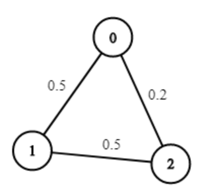

# 1514. Path with Maximum Probability

> https://leetcode.com/problems/path-with-maximum-probability/
>
> Medium

#### Description:

---

You are given an undirected weighted graph of `n` nodes (0-indexed), represented by an edge list where `edges[i] = [a, b]` is an undirected edge connecting the nodes `a` and `b` with a probability of success of traversing that edge `succProb[i]`.

Given two nodes `start` and `end`, find the path with the maximum probability of success to go from `start` to `end` and return its success probability.

If there is no path from `start` to `end`, **return 0**. Your answer will be accepted if it differs from the correct answer by at most **1e-5**.


**Example 1:**



```Java
Input: n = 3, edges = [[0,1],[1,2],[0,2]], succProb = [0.5,0.5,0.2], start = 0, end = 2
Output: 0.25000
Explanation: There are two paths from start to end, one having a probability of success = 0.2 and the other has 0.5 * 0.5 = 0.25.
```


#### Discussion

---

**Find the shortest path by dijkstra**

Dijkstra (edge weighted directed graph)

```java
// record the shortest distance between this node and the start node
Class State{
    int id;
    int distFromStart;
    State(int id, distFromStart){
        this.id = id;
        this.distFromStart = distFromStart;
    }
}

// return the shortest path from start to all others
int[] dijkstra(List<int[]>[] graph, int start) {
    // priority queue, search from the nearest to the farthest (spread from the center). The concept is just like top-down search in a binary tree.
    PriorityQueue<State> pq = new PriorityQueue<>((a,b)->{
        return a.distFromStart - b.distFromStart;
    });
    int[] distTo = new int[graph.length()];
    Arrays.fill(distTo, Integer.MAX_VALUE);
    
    // start
    pq.offer(new State(start, 0));
    distTo[start] = 0;
    while(!pq.isEmpty()) {
        State curState = pq.poll();
        int curNodeId = curState.id;
        int curDistFromStart = curState.distFromStart;
        
        // if there's already a shorter path (similar concept of 'visited' in prim/bfs algorithm)
        if (curDistFromStart > disTo[curNodeId]) continue;
        
        for (neighborEdge : curId.adj()) {
            int nextNodeDistFromStart = distTo[curNodeId] + neighborEdge.weight;
            if (distTo[neighborEdge.to] > nextNodeDistFromStart) { // somethine like: if the node is not visited.
                // update my dp table
                distTo[neighborEdge.to] = nextNodeDistFromStart
                pq.offer(new State(neighborEdge.to, nextNodeDistFromStart));
            }
        }
    }
    return distTo;
}

```

if we only need to calculate the shortest path from start to end, without returning all the other nodes:

```java
int dijkstra(List<int[]>[] graph, int start, int end) {
    // ...
        
    while(!pq.isEmpty()) {
        State curState = pq.poll();
        int curNodeId = curState.id;
        int curDistFromStart = curState.distFromStart;
        
        // add code here
        if (curNodeId == end) return curDistFromStart;
        
        if (curDistFromStart > disTo[curNodeId]) continue;
        
        // ...
    }
    // if end node has never been visited
    return Integer.MAX_VALUE;
}
```


#### Code

----

```Java
class Solution {
    public double maxProbability(int n, int[][] edges, double[] succProb, int start, int end) {
        List<double[]>[] graph = buildGraph(n, edges, succProb);
        double maxProb = dijkstra(graph, start,end);
        return maxProb;
    }
    
    private List<double[]>[] buildGraph(int n, int[][] edges, double[] succProb) {
        List<double[]>[] graph = new LinkedList[n];
        for (int i = 0; i < n; i++) {
            graph[i] = new LinkedList<>();
        }
        
        for (int i = 0; i < edges.length; i++) {
            int from = edges[i][0];
            int to = edges[i][1];
            double prob = succProb[i];
            graph[from].add(new double[]{to, prob});
            graph[to].add(new double[]{from, prob});
        }
        
        return graph;
    }
    
    private class State {
        private int id;
        private double probFromStart;
        
        public State(int id, double probFromStart) {
            this.id = id;
            this.probFromStart = probFromStart;
        }
    }
    
    // return an array that records shortest paths from starter to all the others
    private double dijkstra(List<double[]>[] graph, int start, int end) {
        // use priority queue to sort node by prob (descending order)
        PriorityQueue<State> pq = new PriorityQueue<>((a,b)->{
            return Double.compare(b.probFromStart, a.probFromStart);
        });
        // similar to dp table, record the minimun distance to the start node
        double[] probTo = new double[graph.length];
        Arrays.fill(probTo, Integer.MIN_VALUE);
        
        // start
        pq.offer(new State(start, 1.0));
        probTo[start] = 1.0;
        while(!pq.isEmpty()) {
            State curNode = pq.poll();
            
            // if visit to end
            if (curNode.id == end) return curNode.probFromStart;
            
            // if there's already a shorter path
            if (curNode.probFromStart > probTo[curNode.id]) continue;
            
            for (double[] nextNode : graph[curNode.id]) {
                double nextNodeProbFromStart = probTo[curNode.id] * nextNode[1];
                int nextNodeId = (int) nextNode[0];
                
                // update our probTo table if any path has higher probability
                if (nextNodeProbFromStart > probTo[nextNodeId]) {
                    probTo[nextNodeId] = nextNodeProbFromStart;
                    pq.offer(new State(nextNodeId, nextNodeProbFromStart));
                }
            }
        }
        return 0.0;
    }  
}
```

 
