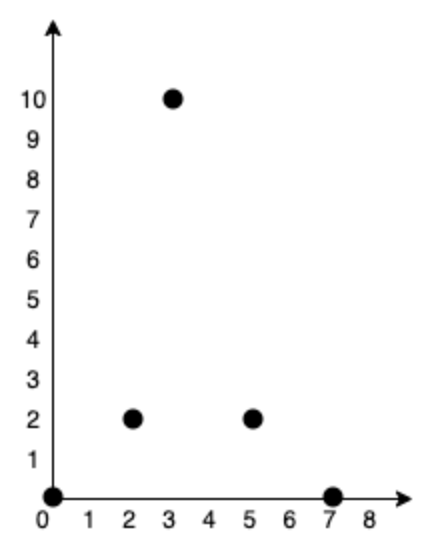
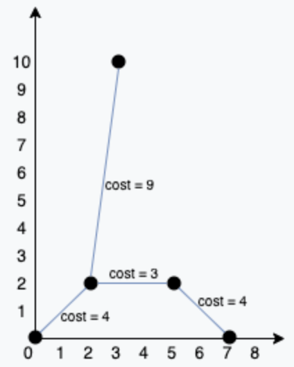

# 1584. Min Cost to Connect All Points

> https://leetcode.com/problems/min-cost-to-connect-all-points/
>
> Medium

#### Description:

---

You are given an array `points` representing integer coordinates of some points on a 2D-plane, where `points[i] = [xi, yi]`.

The cost of connecting two points `[xi, yi]` and `[xj, yj]` is the **manhattan distance** between them: `|xi - xj| + |yi - yj|`, where `|val|` denotes the absolute value of `val`.

Return *the minimum cost to make all points connected.* All points are connected if there is **exactly one** simple path between any two points.

**Example 1:**



```Java
Input: points = [[0,0],[2,2],[3,10],[5,2],[7,0]]
Output: 20
Explanation: 
We can connect the points as shown above to get the minimum cost of 20.
Notice that there is a unique path between every pair of points.
```



#### Discussion

---

**Kruskal MST**

(similar to 1135. Connecting Cities With Minimum Cost)

#### Code

----

```Java
// Kruskal algorithm
class Solution {
    private UF uf;
    private ArrayList<int[]> edges;
    private int cost = 0;
    public int minCostConnectPoints(int[][] points) {
        // build an array of all edges
        edges = new ArrayList<>();
        for (int i = 0; i < points.length; i++) {
            for (int j = i + 1; j < points.length; j++) {
                int dist = Math.abs(points[i][0] - points[j][0]) + Math.abs(points[i][1] - points[j][1]);
                edges.add(new int[] {i, j, dist});
            }
        }
        
        // sort the array based on weight
        Collections.sort(edges, (a, b) -> {
            return a[2] - b[2];
        });
        
        // build tree
        uf = new UF(points.length);
        for (int[] edge : edges) {
            if (!uf.connected(edge[0], edge[1])) {
                uf.union(edge[0], edge[1]);
                cost += edge[2];
            }
        }
        
        return cost;
    }
    
    private class UF {
        ...
    }
}

// Prim's Algorithm
class Solution {
    private PriorityQueue<int[]> pq;
    private int weight;
    private boolean[] visited;
    private List<int[]>[] graph;
    
    public int minCostConnectPoints(int[][] points) {
        pq = new PriorityQueue<>((a, b) -> {
            return a[1] - b[1];
        });
        int sumWeight = 0;
        visited = new boolean[points.length];
        graph = buildGraph(points);
        
        visited[0] = true;
        cut(0);
        while(!pq.isEmpty()) {
            int[] edge = pq.poll();
            int to = edge[0];
            int weight = edge[1];
            if (visited[to]) continue;
            sumWeight += weight;
            visited[to] = true;
            cut(to);
        }
        
        return sumWeight;
    }
    
    private void cut(int i) {
        for (int[] edge : graph[i]) {
            if (visited[edge[0]]) continue;
            pq.offer(edge);
        }
    }
    
    private List<int[]>[] buildGraph(int[][] points) {
        List<int[]>[] graph = new LinkedList[points.length];
        for (int i = 0; i < points.length; i++) {
            graph[i] = new LinkedList<int[]>();
        }
        
        for (int i = 0; i < points.length; i++) {
            for (int j = i + 1; j < points.length; j++) {
                int dist = Math.abs(points[i][0] - points[j][0]) + Math.abs(points[i][1] - points[j][1]);
                graph[i].add(new int[] {j, dist});
                graph[j].add(new int[] {i, dist});
            }
        }
        
        return graph;
    }
}
```

