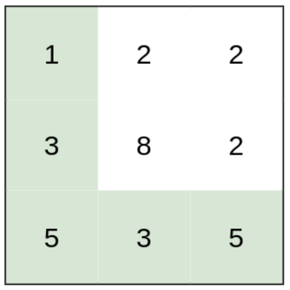

# 1631. Path With Minimum Effort

> https://leetcode.com/problems/path-with-minimum-effort/
>
> Medium

#### Description:

---

You are a hiker preparing for an upcoming hike. You are given `heights`, a 2D array of size `rows x columns`, where `heights[row][col]` represents the height of cell `(row, col)`. You are situated in the top-left cell, `(0, 0)`, and you hope to travel to the bottom-right cell, `(rows-1, columns-1)` (i.e., **0-indexed**). You can move **up**, **down**, **left**, or **right**, and you wish to find a route that requires the minimum **effort**.

A route's **effort** is the **maximum absolute difference** in heights between two consecutive cells of the route.

Return *the minimum **effort** required to travel from the top-left cell to the bottom-right cell*


**Example 1:**



```Java
Input: heights = [[1,2,2],[3,8,2],[5,3,5]]
Output: 2
Explanation: The route of [1,3,5,3,5] has a maximum absolute difference of 2 in consecutive cells.
This is better than the route of [1,2,2,2,5], where the maximum absolute difference is 3.
```


#### Discussion

---

**Find the shortest path by dijkstra**

Dijkstra (edge weighted directed graph)

```java
// record the shortest distance between this node and the start node
Class State{
    int id;
    int distFromStart;
    State(int id, distFromStart){
        this.id = id;
        this.distFromStart = distFromStart;
    }
}

// return the shortest path from start to all others
int[] dijkstra(List<int[]>[] graph, int start) {
    // priority queue, search from the nearest to the farthest (spread from the center). The concept is just like top-down search in a binary tree.
    PriorityQueue<State> pq = new PriorityQueue<>((a,b)->{
        return a.distFromStart - b.distFromStart;
    });
    int[] distTo = new int[graph.length()];
    Arrays.fill(distTo, Integer.MAX_VALUE);
    
    // start
    pq.offer(new State(start, 0));
    distTo[start] = 0;
    while(!pq.isEmpty()) {
        State curState = pq.poll();
        int curNodeId = curState.id;
        int curDistFromStart = curState.distFromStart;
        
        // if there's already a shorter path (similar concept of 'visited' in prim/bfs algorithm)
        if (curDistFromStart > disTo[curNodeId]) continue;
        
        for (neighborEdge : curId.adj()) {
            int nextNodeDistFromStart = distTo[curNodeId] + neighborEdge.weight;
            if (distTo[neighborEdge.to] > nextNodeDistFromStart) { // somethine like: if the node is not visited.
                // update my dp table
                distTo[neighborEdge.to] = nextNodeDistFromStart
                pq.offer(new State(neighborEdge.to, nextNodeDistFromStart));
            }
        }
    }
    
}

```


#### Code

----

```Java
class Solution {
    private int n; // number of all columns
    private int m; // number of all rows
    public int minimumEffortPath(int[][] heights) {
        this.m = heights.length;
        this.n = heights[0].length;
        
        int[] effortTo = dijkstra(heights);
        return effortTo[this.m * this.n - 1];
    }
    
    private class State{
        // maximum absolute difference along the path from start to this node
        int effortFromStart;
        // 1-d index in a 2-d board
        int id;
        State(int id, int effortFromStart){
            this.id = id;
            this.effortFromStart = effortFromStart;
        }
    }

    // return the shortest path from start to all others
    private int[] dijkstra(int[][] graph) {
        PriorityQueue<State> pq = new PriorityQueue<>((a,b)->{
            return a.effortFromStart - b.effortFromStart;
        });
        int[] effortTo = new int[this.m * this.n];
        Arrays.fill(effortTo, Integer.MAX_VALUE);

        // start from the top-left cell (0, 0)
        pq.offer(new State(0, 0));
        effortTo[0] = 0;
        
        // search
        while(!pq.isEmpty()) {
            State curState = pq.poll();
            
            int curNodeId = curState.id;
            int curNodeHeight = graph[curNodeId / n][curNodeId % n];
            int curEffortFromStart = curState.effortFromStart;
            
            // if there's already a path with less effort
            if (curEffortFromStart > effortTo[curNodeId]) continue;

            for (int neighborId : adj(curNodeId)) {
                int dif = Math.abs(graph[neighborId / n][neighborId % n] - curNodeHeight);
                int effortToNeighbor = Math.max(effortTo[curNodeId], dif);
                
                if (effortTo[neighborId] > effortToNeighbor) {
                    effortTo[neighborId] = effortToNeighbor;
                    pq.offer(new State(neighborId, effortToNeighbor));
                }
            }
        }
        
        return effortTo;
    }
    
    private ArrayList<Integer> adj(int id) {
        // calculate 2-d idx
        int curRow = id / this.n;
        int curCol = id % this.n;
        
        ArrayList<Integer> neighbors = new ArrayList<>();
        if (curRow != 0) neighbors.add((curRow - 1)*n + curCol);
        if (curRow != this.m - 1) neighbors.add((curRow + 1)*n + curCol);
        if (curCol != 0) neighbors.add(curRow * n + curCol - 1);
        if (curCol != this.n - 1) neighbors.add(curRow * n + curCol + 1);
        
        return neighbors;
    }
}
```

 
