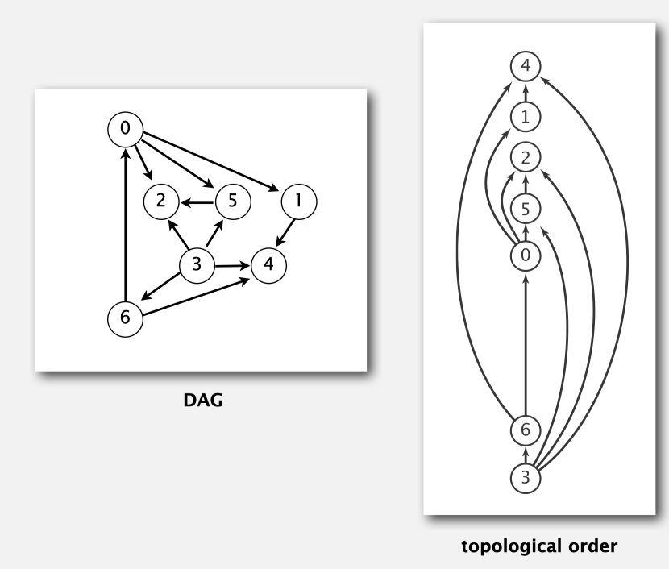

# 207. Course Schedule

> https://leetcode.com/problems/course-schedule/
>
> Medium

#### Description:

---

There are a total of `numCourses` courses you have to take, labeled from `0` to `numCourses - 1`. You are given an array `prerequisites` where `prerequisites[i] = [ai, bi]` indicates that you **must** take course `bi` first if you want to take course `ai`.

- For example, the pair `[0, 1]`, indicates that to take course `0` you have to first take course `1`.

Return `true` if you can finish all courses. Otherwise, return `false`.

**Example 1:**

```Java
Input: numCourses = 2, prerequisites = [[1,0]]
Output: true
Explanation: There are a total of 2 courses to take. 
To take course 1 you should have finished course 0. So it is possible.
```

**Example 2:**

```java
Input: numCourses = 2, prerequisites = [[1,0],[0,1]]
Output: false
Explanation: There are a total of 2 courses to take. 
To take course 1 you should have finished course 0, and to take course 0 you should also have finished course 1. So it is impossible.
```


#### Discussion

---

If there's a loop in a graph, for example `a -> b -> c -> a`, you cannot finish all courses. To take class `a`, you will need to take `b`, and then `c`, and then `a`. Clearly you will never finish the class `a` because there's always a prerequisite that you need to meet first. 

**Topological sort**: redraw <u>directed acyclic graph (DAG)</u> so all edges point upwards. A diagraph has a cycle, topological order is impossible. 



**Solution:** 

Run DFS, if meet the point that is "on-path" (a point may be visited again on another path but should not be visited again on current path), there's a cycle. 

Reference: [Algorithms](http://algs4.cs.princeton.edu)

#### Code

----

```Java
class Solution {
    private boolean[] onPath;
    private boolean[] visited;
    private boolean hasCycle = false;
    private List<Integer>[] graph;
    
    public boolean canFinish(int numCourses, int[][] prerequisites) {
        this.onPath = new boolean[numCourses];
        this.visited = new boolean[numCourses];
        this.graph = buildGraph(numCourses, prerequisites);
        
        for (int i = 0; i < numCourses; i++) {
            if (!visited[i]) dfs(i);
        }
        
        return !hasCycle;
    }
    
    private List<Integer>[] buildGraph(int numCourses, int[][] prerequisites) {
        List<Integer>[] graph = new LinkedList[numCourses];
        for (int i = 0; i < numCourses; i++) graph[i] = new LinkedList<>();
        for (int[] edge : prerequisites){
            int to = edge[0];
            int from = edge[1];
            graph[from].add(to);
        }
        
        return graph;
    }
    
    private void dfs(int start) {
        if (onPath[start]) {
            hasCycle = true;
            return;
        }
        // you should detect cycle before check if been visited!! because if onPath[start] is true, visited[start] should also be true. If first check visited, we cannot check if there's any cycle
        if (visited[start] || hasCycle) return;
        
        visited[start] = true;
        onPath[start] = true;
        for (int end : graph[start]) {
            dfs(end);
        }
        onPath[start] = false;
        
        return;
    }
}
```

