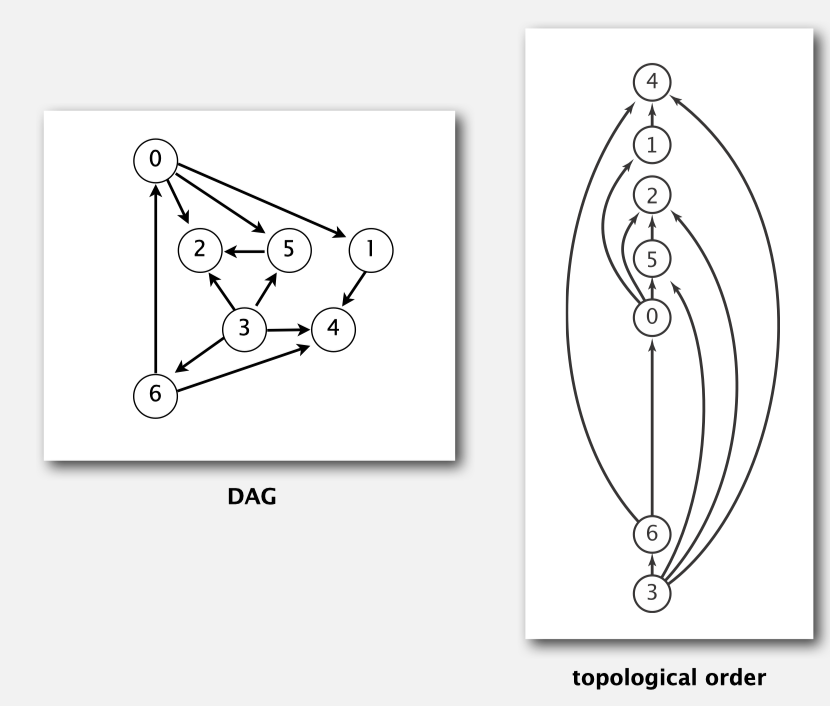
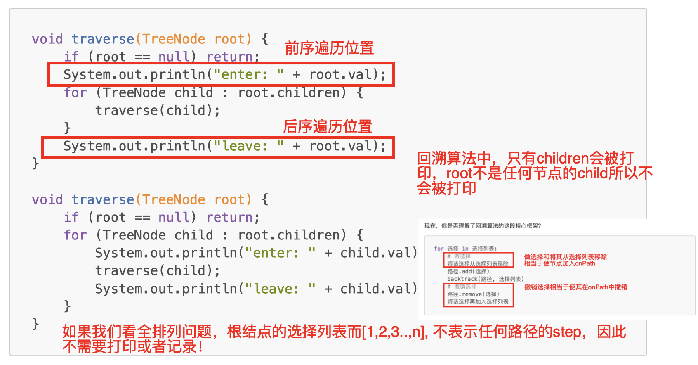

# 210. Course Schedule II

> https://leetcode.com/problems/find-mode-in-binary-search-tree/
>
> Easy

#### Description:

---

There are a total of `numCourses` courses you have to take, labeled from `0` to `numCourses - 1`. You are given an array `prerequisites` where `prerequisites[i] = [ai, bi]` indicates that you **must** take course `bi` first if you want to take course `ai`.

- For example, the pair `[0, 1]`, indicates that to take course `0` you have to first take course `1`.

Return *the ordering of courses you should take to finish all courses*. If there are many valid answers, return **any** of them. If it is impossible to finish all courses, return **an empty array**.

**Example 1:**

```Java
Input: numCourses = 2, prerequisites = [[1,0]]
Output: [0,1]
Explanation: There are a total of 2 courses to take. To take course 1 you should have finished course 0. So the correct course order is [0,1].
```

**Example 2:**

```java
Input: numCourses = 4, prerequisites = [[1,0],[2,0],[3,1],[3,2]]
Output: [0,2,1,3]
Explanation: There are a total of 4 courses to take. To take course 3 you should have finished both courses 1 and 2. Both courses 1 and 2 should be taken after you finished course 0.
So one correct course order is [0,1,2,3]. Another correct ordering is [0,2,1,3].
```


#### Discussion

---

**Topological sort**: redraw <u>directed acyclic graph (DAG)</u> so all edges point upwards. A diagraph has a cycle, topological order is impossible. 



**Solution:** 

Run DFS, reverse the sequence. If meet the point that is "on-path" (a point may be visited again on another path but should not be visited again on current path), there's a cycle, return an empty array.

Reference: [Algorithms](http://algs4.cs.princeton.edu)

**DFS & Backtrack Algorithms:**



Reference: [labuladong的算法秘籍V2.4](https://labuladong.gitee.io/algo/)

#### Code

----

```Java
class Solution {
    private boolean[] onPath;
    private boolean[] visited;
    private boolean hasCycle = false;
    private List<Integer>[] graph;
    private LinkedList<Integer> sequence;
    public int[] findOrder(int numCourses, int[][] prerequisites) {
        this.onPath = new boolean[numCourses];
        this.visited = new boolean[numCourses];
        sequence = new LinkedList<>();
        this.graph = buildGraph(numCourses, prerequisites);
        
        for (int i = 0; i < numCourses; i++) {
            if (!visited[i]) dfs(i);
        }
        
        if (hasCycle) return new int[]{};
        else {
            int[] result = new int[numCourses];
            for (int i = 0; i < numCourses; i++) result[i] = sequence.pollLast();
            return result;
        }

    }
    
    private List<Integer>[] buildGraph(int numCourses, int[][] prerequisites) {
        List<Integer>[] graph = new LinkedList[numCourses];
        for (int i = 0; i < numCourses; i++) graph[i] = new LinkedList<Integer>();
        for (int[] edge : prerequisites){
            int to = edge[0];
            int from = edge[1];
            graph[from].add(to);
        }
        
        return graph;
    }
    
    private void dfs(int start) {
        if (onPath[start]) {
            hasCycle = true;
            return;
        }
        if (visited[start] || hasCycle) return;
        
        visited[start] = true;
        onPath[start] = true;
        for (int end : graph[start]) {
            // if detected a cycle during dfs
            dfs(end);
        }
        onPath[start] = false;
        
        // your sequence should be updated after all subtrees have been traversed!
        sequence.addLast(start);
        
        return;
    }

}
```

