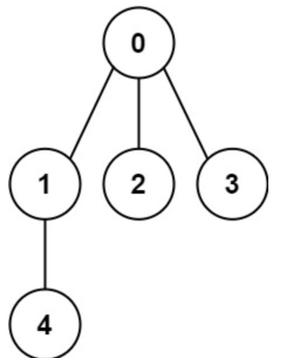

# 261. Graph Valid Tree

> https://leetcode.com/problems/graph-valid-tree/
>
> Medium

#### Description:

---

You have a graph of `n` nodes labeled from `0` to `n - 1`. You are given an integer n and a list of `edges` where `edges[i] = [ai, bi]` indicates that there is an undirected edge between nodes `ai` and `bi` in the graph.

Return `true` *if the edges of the given graph make up a valid tree, and* `false`*otherwise*.

**Example 1:**



```Java
Input: n = 5, edges = [[0,1],[0,2],[0,3],[1,4]]
Output: true
```


#### Discussion

---

**Minimum Spanning Tree**

* No cycle
* all vertices are connected
* includes all vertices in a graph
* Minimum edge weights

**Algorithms to find the MST**

* Greedy algorithm

* Kruskal's algorithm

    * Sort graph edges by weight

    * Add edge to the tree unless doing so would create a cycle

    * To detect cycle: Union-Find data structure (time complexity of UF is log* V, where as time complexity of dfs is V).

    * Its code is similar to bfs and level order traversal.

    * Pseudocode:

        ```java
        public class KruskalMST{
        	private Queue<Edge> mst = new Queue<>();
            
            public KruskalMST (graph){
                // build priority queue
                MinPQ<Edge> pq = new minPQ<>();
                for (edge in graph) pq.add(edge);
                
                UF uf = new UF(n) // n is the vertex number of the graph
                // for n vertices, use n-1 edges to connect them
                while (!pq.isEmpty() && mst.size() < n - 1) {
                    Edge e = pq.delMin();
                    if (vertices of the edge is not in the same component){
                        uf.union(two vertices);
                        mst.add(e);
                    }
                }
            }
        }
        ```

* Prim's algorithm

#### Code

----

```Java
class Solution {
    public boolean validTree(int n, int[][] edges) {
        UF uf = new UF(n);
        
        for (int[] edge : edges) {
            int from = edge[0], to = edge[1];
            if (uf.connected(from, to)) return false;
            uf.union(from, to);
        }
        
        return uf.count() == 1;
    }
    
    private class UF {
        ...
    }

}
```

