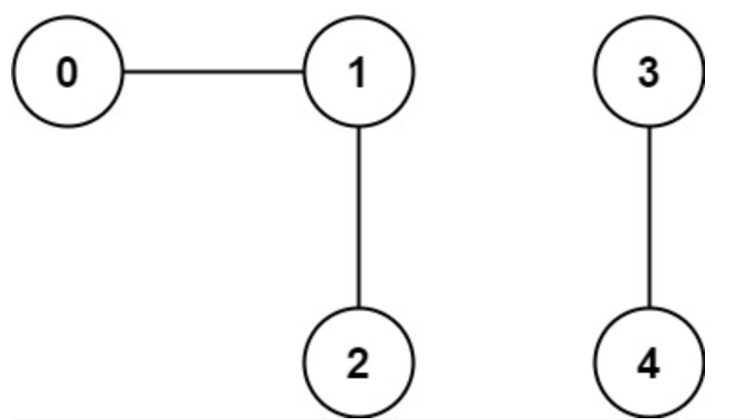

# 323. Number of Connected Components in an Undirected Graph

> https://leetcode.com/problems/number-of-connected-components-in-an-undirected-graph/
>
> Medium

#### Description:

---

You have a graph of `n` nodes. You are given an integer `n` and an array `edges` where `edges[i] = [ai, bi]` indicates that there is an edge between `ai` and `bi` in the graph.

Return *the number of connected components in the graph*.

**Example 1:**



```Java
Input: n = 5, edges = [[0,1],[1,2],[3,4]]
Output: 2
```


#### Discussion

---

**Union-Find**

```java
class UF {
    // count united components
    private int count;
    // root of each node
    private int[] parent;

    public UF(int n) {
        this.count = n;
        parent = new int[n];
        for (int i = 0; i < n; i++) {
            parent[i] = i;
        }
    }
    
    // unite two node if theiy're not connected
    public void union(int p, int q) {
        int rootP = find(p);
        int rootQ = find(q);
        
        if (rootP == rootQ) return;
        
        parent[rootQ] = rootP;
        count--;
    }

    // if the two nodes share the same parent/root?
    public boolean connected(int p, int q) {
        int rootP = find(p);
        int rootQ = find(q);
        return rootP == rootQ;
    }

    public int find(int x) {
        if (parent[x] != x) {
            parent[x] = find(parent[x]);
        }
        return parent[x];
    }

    // return the count of united components
    public int count() {
        return count;
    }
}
```

Reference: [labuladong的算法密集V2.4](https://labuladong.gitee.io/algo/)


#### Code

----

```Java
// Draft here. A more standard and clear way to implement UF, see discussion
class Solution {
    private int[] uf;
    // count unconnected components
    private int count;
    public int countComponents(int n, int[][] edges) {
        this.uf = new int[n];
        for (int i = 0; i < n; i++) {
            this.uf[i] = i;
        }
        count = n;
        
        for (int[] pair : edges) {
            int from = pair[0], to = pair[1];
            union(from, to);
        }
        
        return count;
    }
    
    private void union(int i, int j) {
        int ancestorI = ancestor(i);
        int ancestorJ = ancestor(j);
        if (ancestorI == ancestorJ) return;
        
        // if the two nodes are not in the same component, connect their ancestors!
        uf[ancestorI] = ancestorJ;
        count--;
    }
    
/*    // one way to find ancestor
    private int ancestor(int i) {
        int currentNode = i;
        while(uf[i] != i) {
            i = uf[i];
        }
        // each time we find ancestor, reduce tree depth;
        uf[currentNode] = i;
        return i;
    }
*/
    
    // More efficient way to reduce tree depth
    private int ancestor(int i) {
        if(uf[i] != i) {
            uf[i] = ancestor(uf[i]);
        }
        return uf[i];
    }
}
```

