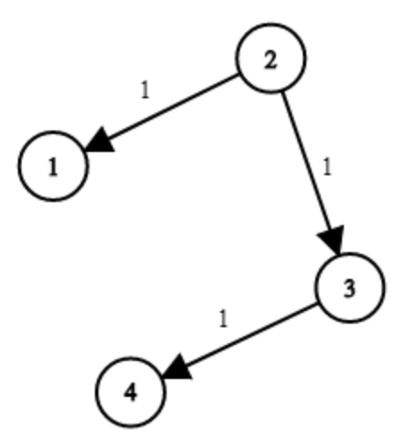

# 743. Network Delay Time

> https://leetcode.com/problems/network-delay-time/
>
> Medium

#### Description:

---

You are given a network of `n` nodes, labeled from `1` to `n`. You are also given `times`, a list of travel times as directed edges `times[i] = (ui, vi, wi)`, where `ui` is the source node, `vi` is the target node, and `wi` is the time it takes for a signal to travel from source to target.

We will send a signal from a given node `k`. Return *the **minimum** time it takes for all the* `n`*nodes to receive the signal*. If it is impossible for all the `n` nodes to receive the signal, return `-1`.

**Example 1:**



```Java
Input: times = [[2,1,1],[2,3,1],[3,4,1]], n = 4, k = 2
Output: 2
```


#### Discussion

---

**Compare BFS framework in different situations**

1. Level-order traversal (binary/poly tree)

    ```java
    void levelOrder(TreeNode root) {
        Queue<TreeNode> q = new LinkedList<>();
        if (root == null) return;
    
        q.offer(root);
        int depth = 1;
        while(!q.isEmpty()){
            int sz = q.size();
            for (int i = 0; i < sz; i++) {
                TreeNode temp = q.poll();
                print(temp, depth);
    			for (TreeNode child : temp.children) {
                    q.offer(child);
                }
            }
            depth++;
        }
    }
    ```

2. BFS (directed graph)

    ```java
    int BFS(Node start) {
        Queue<Node> q;
        Set<Node> visited;
        
        q.offer(start);
        visited.add(start);
        
        int step = 0;
        while(!q.isEmpty()) {
            int sz = q.size();
            for (inde i = 0; i < sz; i++) {
                Node cur = q.poll();
                print("shortest path from start to cur", step);
                
                for (Node x : cur.adj()) {
                    if (x is not visited) {
                        q.offer(x);
                        visited.add(x);
                    }
                }
            }
            step++;
        }
    }
    ```

3. Prim (edge weighted undirected graph)

    ```java
    List<int[]> prim(List<int[]>[] graph) {
        List<int[]> mst = new LinkedList<>();
        PriorityQueue<int[]> pq = new PriorityQueue<>((a, b) -> {
            return a[2] - b[2];
        });
        boolean[] visited = new boolean[graph.length];
    
        visited[0] = true;
        cut(0);
        while(!pq.isEmpty()) {
            int[] edge = pq.poll();
            
            int to = edge[1];
            int weight = edge[2];
            
            if (visited[to]) continue;
            
            visited[to] = true;
            mst.add(edge);
            
            
            cut(to);
        }
        return mst;
    }
    
    // add all edges from vertex i into the priority queue (similar to x.adj() in bfs)
    void cut(int i) {
        for (int[] edge : graph[i]) {
            if (visited[edge[1]]) continue;
            pq.offer(edge);
        }
    }
    
    ```

    

4. Dijkstra (edge weighted directed graph)

    * Different between Dijkstra and bfs: bfs search nodes by depth, children are visited only after all nodes its previous layer have been searched. Dijkstra search nodes by weight, nodes with minimum path to the start are always being visited preferentially. 

```java
// record the shortest distance between this node and the start node
Class State{
    int id;
    int distFromStart;
    State(int id, distFromStart){
        this.id = id;
        this.distFromStart = distFromStart;
    }
}

// return the shortest path from start to all others
int[] dijkstra(List<int[]>[] graph, int start) {
    // priority queue, search from the nearest to the farthest (spread from the center). The concept is just like top-down search in a binary tree.
    PriorityQueue<State> pq = new PriorityQueue<>((a,b)->{
        return a.distFromStart - b.distFromStart;
    });
    int[] distTo = new int[graph.length()];
    Arrays.fill(distTo, Integer.MAX_VALUE);
    
    // start
    pq.offer(new State(start, 0));
    while(!pq.isEmpty()) {
        State curState = pq.poll();
        int curNodeId = curState.id;
        int curDistFromStart = curState.distFromStart;
        
        // if there's already a shorter path (similar concept of 'visited' in prim/bfs algorithm)
        if (curDistFromStart > disTo[curNodeId]) continue;
        
        for (neighborEdge : curId.adj()) {
            int nextNodeDistFromStart = distTo[curNodeId] + neighborEdge.weight;
            if (distTo[neighborEdge.to] > nextNodeDistFromStart) { // somethine like: if the node is not visited.
                // update my dp table
                distTo[neighborEdge.to] = nextNodeDistFromStart
                pq.offer(new State(neighborEdge.to, nextNodeDistFromStart));
            }
        }
    }
    
}

```


reference: [labuladong的算法秘籍V2.4]()

#### Code

----

```Java
class Solution {
    private List<int[]>[] graph;
    private int n;
    public int networkDelayTime(int[][] times, int n, int k) {
        this.graph = buildGraph(times, n);
        this.n = n;
        
        int[] distTo = dijkstra(k-1);
        
        int res = 0;
        // return the minimum time that all nodes received the signal
        // the statement is equivalent to the minimum time that farthest node receive the signal. 
        for (int weight : distTo) {
            if (weight == Integer.MAX_VALUE) return -1;
            else res = Math.max(res, weight);
        }
        
        return res;
    }
    
    private List<int[]>[] buildGraph(int[][] times, int n) {
        List<int[]>[] graph = new LinkedList[n];
        for (int i = 0; i < n; i++) {
            graph[i] = new LinkedList<>();
        }
        
        for (int[] edge : times) {
            int from = edge[0] - 1;
            int to = edge[1] - 1;
            int weight = edge[2];
            graph[from].add(new int[]{from, to, weight});
        }
        
        return graph;
    }
    
    private class State {
        private int id;
        private int distFromStart;
        
        public State(int id, int distFromStart) {
            this.id = id;
            this.distFromStart = distFromStart;
        }
    }
    
    // return an array that records shortest paths from starter to all the others
    private int[] dijkstra(int k) {
        // use priority queue to sort node by weight -> greedy strategy
        PriorityQueue<State> pq = new PriorityQueue<>((a,b)->{
            return a.distFromStart - b.distFromStart;
        });
        // similar to dp table, record the minimun distance to the start node
        int[] distTo = new int[this.n];
        Arrays.fill(distTo, Integer.MAX_VALUE);
        
        // start
        pq.offer(new State(k, 0));
        distTo[k] = 0;
        while(!pq.isEmpty()) {
            State curNode = pq.poll();
            
            // if there's already a shorter path
            if (curNode.distFromStart > distTo[curNode.id]) continue;
            
            for (int[] nextNode : this.graph[curNode.id]) {
                int nextNodeDistFromStart = distTo[curNode.id] + nextNode[2];
                int nextNodeId = nextNode[1];
                
                // updat our distTo table if any path is shorter
                if (nextNodeDistFromStart < distTo[nextNodeId]) {
                    distTo[nextNodeId] = nextNodeDistFromStart;
                    pq.offer(new State(nextNodeId, nextNodeDistFromStart));
                }
            }
        }
        return distTo;
    }
}
```

 
