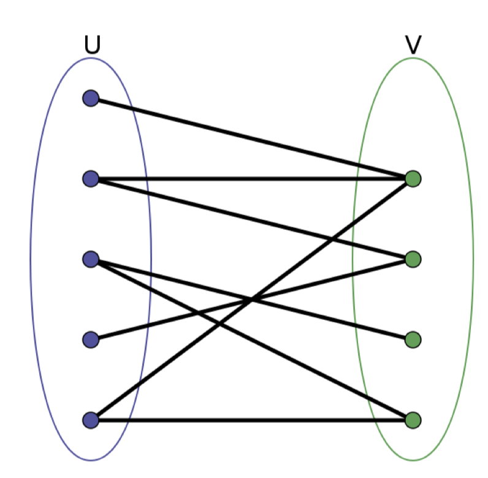

# 785. Is Graph Bipartite?

> https://leetcode.com/problems/is-graph-bipartite/
>
> Medium

#### Description:

---

There is an **undirected** graph with `n` nodes, where each node is numbered between `0` and `n - 1`. You are given a 2D array `graph`, where `graph[u]` is an array of nodes that node `u` is adjacent to. More formally, for each `v` in `graph[u]`, there is an undirected edge between node `u` and node `v`. The graph has the following properties:

- There are no self-edges (`graph[u]` does not contain `u`).
- There are no parallel edges (`graph[u]` does not contain duplicate values).
- If `v` is in `graph[u]`, then `u` is in `graph[v]` (the graph is undirected).
- The graph may not be connected, meaning there may be two nodes `u` and `v`such that there is no path between them.

A graph is **bipartite** if the nodes can be partitioned into two independent sets `A` and `B` such that **every** edge in the graph connects a node in set `A` and a node in set `B`.

Return `true` *if and only if it is **bipartite***.

**Example 1:**


```Java
Input: graph = [[1,2,3],[0,2],[0,1,3],[0,2]]
Output: false
Explanation: There is no way to partition the nodes into two independent sets such that every edge connects a node in one and a node in the other.
```


#### Discussion

---

**Bipartite:**




Reference: [labuladong的算法密集V2.4](https://labuladong.gitee.io/algo/)

Similar problem: [886. Possible Bipartition](https://leetcode.com/problems/possible-bipartition/)


#### Code

----

```Java
class Solution {
    private int[] visited;
    private int[][] graph;
    private boolean isBipartite = true;
    public boolean isBipartite(int[][] graph) {
        this.graph = graph;
        int n = graph.length;
        visited = new int[n];
        Arrays.fill(visited, -1);
        
        for (int i = 0; i < n; i++) {
            if (visited[i] == -1) traverse(i, 1);
        }
        
        return isBipartite;
    }
    
    private void traverse(int from, int part){
        if (!isBipartite) return;
        
        if (visited[from] != -1){
            if (visited[from] == part) return;
            else {
                isBipartite = false;
            }
        }
        
        visited[from] = part;
        int childPart = (part == 1) ? 2 : 1;
        for (int to : graph[from]) {
            traverse(to, childPart);
        }
        
    }
}
```

