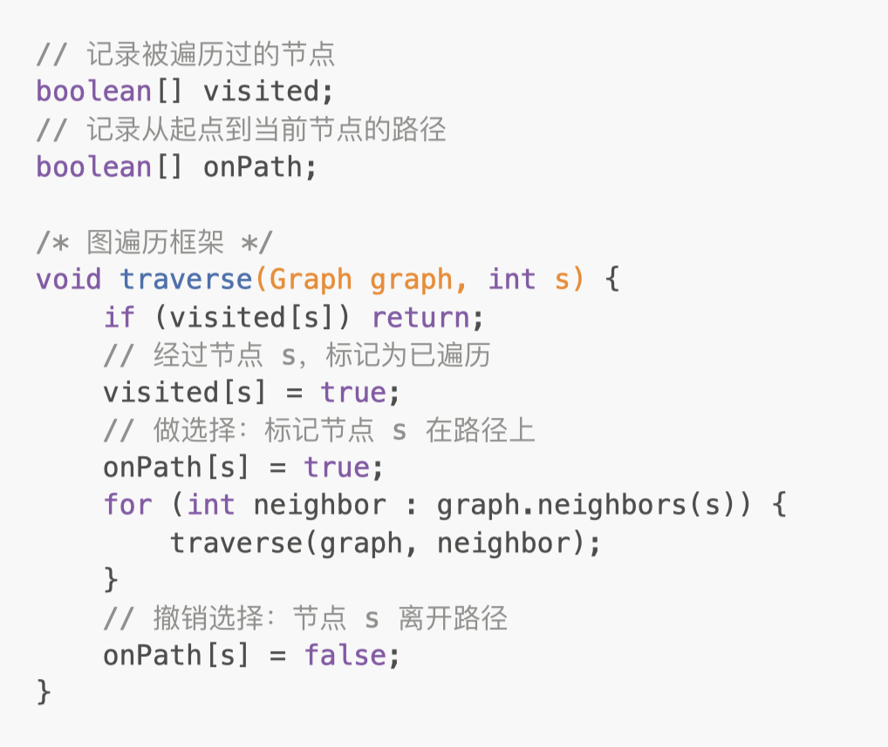
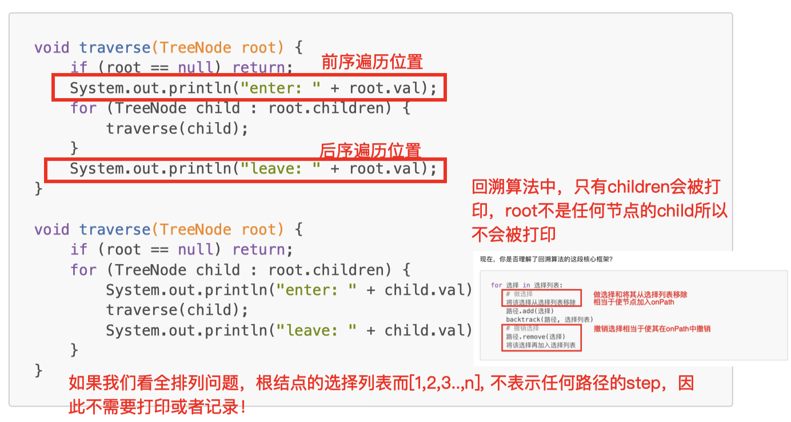

# 797. All Paths From Source to Target

> https://leetcode.com/problems/all-paths-from-source-to-target/
>
> Easy

#### Description:

---

Given a directed acyclic graph (**DAG**) of `n` nodes labeled from `0` to `n - 1`, find all possible paths from node `0` to node `n - 1` and return them in **any order**.

The graph is given as follows: `graph[i]` is a list of all nodes you can visit from node `i` (i.e., there is a directed edge from node `i` to node `graph[i][j]`).

**Example 1:**


```Java
Input: graph = [[1,2],[3],[3],[]]
Output: [[0,1,3],[0,2,3]]
Explanation: There are two paths: 0 -> 1 -> 3 and 0 -> 2 -> 3.
```


#### Discussion

---

**Data structure of a graph**

```java
/* Adjacency List, directed graph*/
List<Integer>[] graph;

/* Adjacency Table, directed graph*/
boolean[][] matrix
    
/* Adjacency List, weighted directed graph*/
List<int[]>[] graph;

/* Adjacency Table, weighted directed graph*/
int[][] matrix
```


**Graph Traversal**



* `onPath` array is to avoid forming a loop in a graph.


**BackTracking**



Reference: [labuladong的算法秘籍](https://labuladong.gitee.io/algo/)


#### Code

----

```Java
class Solution {
    private List<List<Integer>> library;
    public List<List<Integer>> allPathsSourceTarget(int[][] graph) {
        library = new LinkedList<>();
        LinkedList<Integer> path = new LinkedList<>();
        path.addLast(0);
        traverse(graph, 0, path);
        return library;
    }
    
    private void backtrack(int[][] graph, int start, LinkedList<Integer> path){
        if (start == graph.length - 1) {
            List<Integer> pathSelected = new LinkedList<>(path);
            library.add(pathSelected);
            return;
        }
        
        for (int end : graph[start]) {
            path.addLast(end);
            traverse(graph, end, path);
            path.pollLast();
        }
    }
}
```

